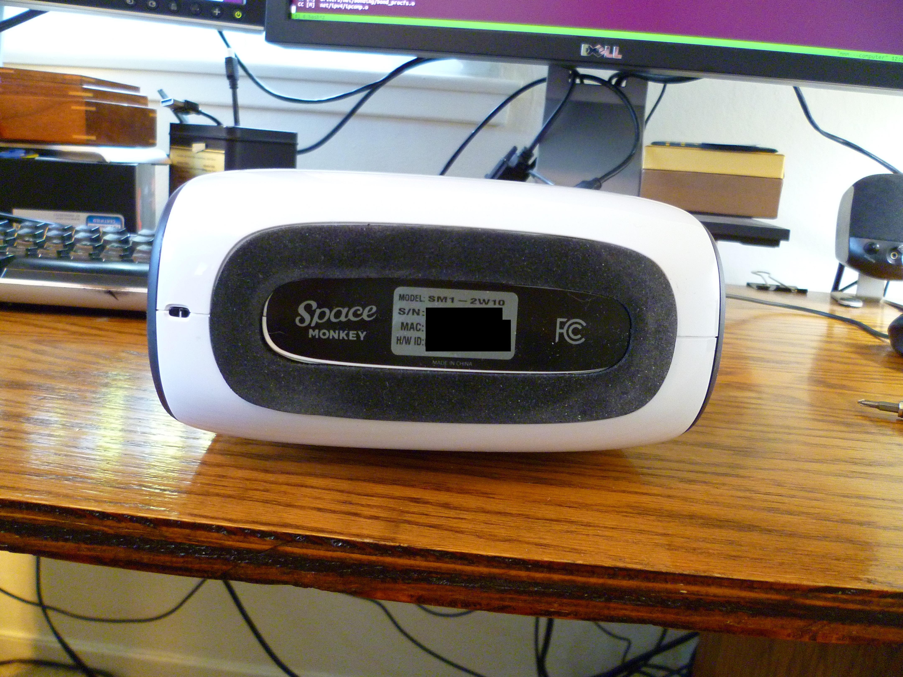
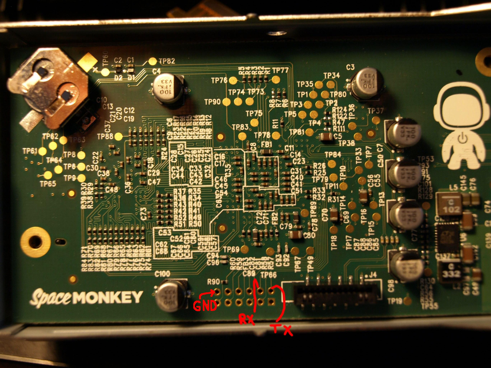

# Process for rooting Space Monkey device

## Minimal Procedure
</img>
- Open device 
    - Power off device
    - Remove label and screws from bottom of device. Screws are Torx T-10.
    -   </img> -> </img>
    - Pry apart plastic shell with much force (ideally without injuring yourself or others)
        - </img> -> </img>, </img>
- Create bootable disk
    - Partition a new disk
        - gpt is ok
        - Linux can use virtually anything as a root FS, but UBoot can boot from ext3 (perhaps not ext4?)
        - default UBoot attempts to boot from `/dev/sda1`. UBoot probably enumerates USB devices starting at `/dev/sdb`, but requires the kernel to be on IDE 0.
    - Install a root FS
        - mount root partition at `/tmp/smboot`
        - `sudo apt-get install debootstrap`
        - `sudo debootstrap --arch armel --foreign sid /tmp/smboot/`
    - Point `/etc/apt/sources.list` on root FS to `deb http://ftp.us.debian.org/debian sid main`
      - Not all mirrors have `armel` packages
    - set up a chroot
        - `sudo apt-get install qemu-user-static`
        - `sudo cp /usr/bin/qemu-arm-static /tmp/smboot/usr/bin/`
        - `sudo chroot /tmp/smboot`
    - finish bootstrap in chroot
        - `/debootstrap/debootstrap --second-stage`
    - set a root password in chroot
        - `passwd`
    - install some things in chroot
        - `apt-get install u-boot-tools openssh-server`
    - set a hostname in /etc/hostname
    - enable DHCP on eth0 and set the correct MAC address (it’s on the sticker from the bottom of the device)
        - Put the following in /etc/systemd/network/eth0.network:
                
                [Match]
                Name=eth0
                
                [Network]
                DHCP=both
                
                [Link]
                MACAddress=<your MAC here>

        - This worked for me; if it doesn't work for you, try modifying /etc/network/interfaces and adding the code:
                
                auto eth0
                iface eth0 inet dhcp
                
    - Enable networkd (todo: test this in chroot)
        - `systemctl enable systemd-networkd.service`
    - enable root login over ssh (just for now; you can disable it later)
        - `sed -i /etc/ssh/sshd_config -re 's/^(PermitRootLogin)[[:space:]]+.*/\1 yes/'`
    - If you want to modify anything else on the boot drive, now is the time. E.g., add users, edit sudoers, etc.
    - exit chroot
        - `exit`
- Install a kernel at /boot/uImage on the root FS
    - `sudo wget https://github.com/Ft1Byh0hl/spacemonkey_data/blob/master/uImage-3.19?raw=true -O /tmp/smboot/boot/uImage`
- Connect bootable disk and network, boot system, find IP address from DHCP
    - check your router/DHCP server for new leases
- login to the system with ssh using the password you set previously
    - `ssh root@<IP address>`
- Get original disk passkey from UBoot environment
    - put the following in `/etc/fw_env.config`: `/dev/mtd0 0xE0000 0x20000 0x20000`
      - the fields are as follows: MTD Device, Offset, Size, Sector Size
    - `export hdd_password=$(fw_printenv  | sed -nre 's/hdd_password=(.*)/\1/p'); echo $hdd_password`
        - write this down!
- Get root on original FS with passkey
    - connect original disk to another machine
        - screws holding rubber pads are ~ 7/64” hex (~3mm)
        - this connection probably has to be direct SATA or eSATA; I doubt ATA security commands work over USB-SATA adapters.
    - unlock disk with passkey from above (stored in hdd_password shell environment variable), assuming original Space Monkey disk is `/dev/sdb`.
        - `hdparm --security-disable $hdd_password /dev/sdb`
    - Set a new root password, add another user with sudo, add your ssh key, etc.
    - Connect original Space Monkey disk back to Space Monkey device
- Enjoy root!

## Optional

- Remove Space Monkey software
  - "Keep" key: 
    - "y": required for general operation
    - "u": nonessential but potentially useful
    - "sm": Space Monkey proprietary service-related

|package|description|keep?|
|---|---|---|
|spacemonkey-alart-client|sends messages (presumably to Space Monkey)|sm|
|spacemonkey-apt-keyring||only if you want apt updates from Space Monkey|
|spacemonkey-assets|sample AV files|sm|
|spacemonkey-batsudo|?|sm|
|spacemonkey-blinkenlights|controls the multicolored LED|u|
|spacemonkey-bwlimit|limits upstream bandwidth|u|
|spacemonkey-bwtest-client|bandwidth test, uses Space Monkey server by default|u|
|spacemonkey-bwtest-common|support package for bandwidth test|u|
|spacemonkey-cgroups-setup|sets up cgroups|u|
|spacemonkey-cmdline|command-line interface to virtual filesystem|sm; fun to play with!|
|spacemonkey-cnl|"Device service management"|sm|
|spacemonkey-cores|allows core dumps|u|
|spacemonkey-current-kernel|depends on current kernel package|y|
|spacemonkey-device|master dependency metapackage|sm|
|spacemonkey-dmclient|some remote management tool|sm|
|spacemonkey-dmdevinfo|gathers device info|sm|
|spacemonkey-dvr|Saves camera streams (Vivint)|sm|
|spacemonkey-dvr-api-server||sm|
|spacemonkey-ffmpeg|provides ffmpeg.sm|u|
|spacemonkey-flud||sm|
|spacemonkey-flud-prodconfig||sm|
|spacemonkey-fludlib||sm|
|spacemonkey-gaki|mounts VFS locally in /mnt/gaki|sm|
|spacemonkey-goflud||sm|
|spacemonkey-hwmond||sm|
|spacemonkey-hwmonitor||sm|
|spacemonkey-kernel-3.8.6-1-armel||only if you want to be able to boot|
|spacemonkey-logging|configures local logging|u|
|spacemonkey-machoman|device service management|sm|
|spacemonkey-nas|configures DLNA, AFP, FTP, SMB|sm|
|spacemonkey-nas-deps|dependency package|u|
|spacemonkey-ntp|delays ntp service startup until successful ntpdate|u|
|spacemonkey-oom-watcher|watches for OOM (out-of-memory) events|u|
|spacemonkey-provisioning|provisioning client|sm|
|spacemonkey-space|VFS library|sm|
|spacemonkey-updater|updates Space Monkey packages on boot|sm|
|spacemonkey-users|creates spacemonkey system user|sm|
|spacemonkey-vital|minimal bootstrapping packages|sm|
|spacemonkey-watchdog|kernel watchdog check-in|y?|
|spacemonkey-workaround-busted-dns|fixes DNS issues|u|

- Serial access - super handy!
    - </img>
    - </img>
    - </img>
- Compile kernel
    - ...
    - remember to set MAC address in dts file; otherwise, you’ll get 70:93:f8:00:09:7b (?)
    - ...

## UBoot environment
    bootargs=${console} root=/dev/sda1  
    bootcmd=run reset_button_test; run bootstrap_test; run upgrade_test; run hdd_boot; run nand_boot; run led_fail;  
    bootdelay=0  
    bootstrap_test=if test ${sm_bootstrap}_ = true_; then run nand_boot; fi  
    clear_sm_upgrade=setenv sm_upgrade false; saveenv  
    console=console=ttyS0,115200  
    ethact=egiga0  
    hdd_boot=ide reset; run hdd_unlock; run hdd_load_kernel hdd_set_args hdd_boot_cmd  
    hdd_boot_cmd=bootm ${kernel_addr}  
    hdd_load_kernel=ext2load ide 0 ${kernel_addr} boot/uImage  
    hdd_set_args=setenv bootargs ${console} ${mtdparts} root=/dev/sda1  
    hdd_unlock=if test ${hdd_password}_ != _; then if ide unlock ${hdd_password}; then ide freeze; fi; fi  
    initrd_addr=0x1100000  
    kernel_addr=0x800000  
    led_fail=led green off; led blue off; while true; do led red on; sleep 1; led red off; sleep 1; led red on; sleep 1; led   red off; sleep 1; led red on; sleep 1; led red off; sleep 3; done  
    mfg_location=Compeq  
    mfg_timestamp=Sun Sep 15 08:44:07 2013 UTC  
    mtdids=nand0=orion_nand  
    mtdparts=mtdparts=orion_nand:1M(uboot),4M(uImage),10M(recovery),1M(secure),-(data)  
    nand_boot=run nand_load_kernel nand_set_args nand_boot_cmd  
    nand_boot_cmd=bootm ${kernel_addr}  
    nand_load_kernel=nand read ${kernel_addr} nand0,1  
    nand_set_args=setenv bootargs ${console} ${mtdparts} root=/dev/mtdblock2 ro   
    rootfstype=jffs2  
    reset_button_test=if resetbutton; then run nand_boot; fi  
    silent=true  
    stderr=serial  
    stdin=serial  
    stdout=serial
    upgrade_boot=run clear_sm_upgrade nand_load_kernel upgrade_set_args nand_boot_cmd  
    upgrade_set_args=setenv bootargs ${console} ${mtdparts} root=/dev/mtdblock2 ro rootfstype=jffs2 smupgrade=true  
    upgrade_test=if test ${sm_upgrade}_ = true_; then run upgrade_boot; fi  
    sm_image_timestamp=Sat Sep 21 21:59:20 UTC 2013  
    ethaddr=70:93:f8:00:09:7b  
    hdd_password=QhzO_C8bkUPuBECBoQNh7YoTO7OTErIN  
    sm_preprovision_timestamp=Sat Sep 21 21:59:22 UTC 2013  
    sm_bootstrap=false  
